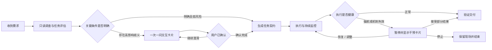

# Visionox-Whale 通用复杂任务状态机目标基线

> 状态：目标基线；前台统一执行内核已完成源码接线，真实 release 任务矩阵尚未验收
> 更新：2026-07-21
> 优先级：本文件定义主目标。具体实现方案、领域 Adapter、Skill 和历史实施说明不得改变或缩小本目标。

## 1. 唯一主目标

Visionox-Whale 要建设的是一套面向所有复杂任务的通用任务状态机，而不是文档任务状态机，也不是上下文缓存状态机。

复杂任务包括但不限于：大型文档处理、代码开发与重构、多来源研究、批量文件操作、报告生成、知识构建，以及需要多轮工具调用、检查点、恢复或用户决策的长程任务。

状态机必须保证：

> 模型能力影响语义产出的质量和效率，但不能决定任务事实、生命周期、覆盖范围、恢复能力和是否完成。

宿主程序负责任务契约、执行状态、检查点、证据、验收和最终 Outcome；模型负责理解、推理、规划建议和语义内容生成。

### 1.1 产品主控制流程

以下流程是通用复杂任务状态机面向用户和产品行为的主流程，也是后续设计、实现和验收的首要依据：



该流程包含四个不能被子机制替代的控制门：

1. **评估门**：执行前先进行只读调查，识别任务类型、复杂度、风险和关键歧义。
2. **契约门**：关键条件明确或经用户确认后，才能生成可执行、可验收的任务契约。
3. **健康门**：执行期间持续判断是否有真实进展、是否偏离目标、底层机制是否仍然适用。
4. **交付门**：完整结果和用户接受的部分结果都必须经过验证；二者形成不同的 Outcome，不能混为“完整完成”。

“保留现场并结束”必须持久保存任务契约、已确认进度、阶段产物、失败证据和恢复入口。它不是静默中止，也不能清除任务事实。

后文的内部生命周期、上下文输入事务、检查点、重试预算、Adapter 和 Skill 都服务于这条主控制流程，不能自行替代或绕过其中任何一道控制门。

### 1.2 渐进式需求澄清与干预协议

该状态机不能让所有请求都进入重型计划和反复确认。收到任何需求后可以进行轻量、静默的只读评估，但只有复杂、高风险、长时间或高不确定性任务才进入完整生命周期。

“一次一问、带建议提问、主动补全、追问到底、先澄清后执行”适合复杂、高风险、长时间任务；如果全局无差别强制，会让“打开文件”“解释代码”等简单任务也陷入反复确认。因此采用渐进式需求澄清与干预协议，根据任务影响、风险和不确定性决定是否升级为严苛专家模式。

全局决策原则是：

- 能从当前对话、文件、配置和已有任务状态确定的，自动补全。
- 安全、低风险且可逆的，直接执行。
- 会显著影响结果但无法确定的，一次只询问一个问题。
- 涉及不可逆操作、覆盖、外部发送、权限扩大或明显风险的，先确认再执行。
- 执行中偏离契约、没有真实进展或底层机制失效的，暂停并请用户干预。

简单请求可以在评估后走快速通道，例如打开文件、读取少量信息、解释代码或执行明确的只读查询。快速通道仍保留权限和结果真实性约束，但不强制创建持久 WorkPlan、交互卡片或后台任务。

流程图中快速通道经过的“生成任务契约”可以只是本回合内的最小执行意图，用于记录目标和完成条件，不引入持久任务开销。只有任务满足复杂任务升级条件时，才创建完整、可恢复的持久 TaskContract 和 WorkPlan。

以下任一条件成立时，应升级为完整复杂任务状态机：

- 存在多个相互依赖的步骤；
- 输入规模、执行时间或工具轮数可能超过单个稳定回合；
- 需要生成、修改或提交持久产物；
- 需要跨压缩、程序重启或模型切换恢复；
- 存在外部副作用、不可逆操作或显著安全风险；
- 用户目标、范围或验收标准存在高影响歧义；
- 运行过程中已经出现偏航、重复、停滞或机制失效。

### 1.3 最终架构结论

系统应实现运行时通用的“任务评估、澄清、执行、监控、干预、验收”协议；Skill 只补充各领域的专家检查表和执行策略。

这样，即使没有 Skill 或模型能力较弱，宿主仍能阻止盲目执行、无限循环、输入丢失和虚假完成；模型能力较强时，又可以在不突破生命周期和验收边界的前提下减少不必要的追问、扩大自主执行空间。

## 2. 要解决的核心问题

当前复杂任务可能因为模型能力、工具返回量、上下文压缩、程序重启或用户需求不明确而出现以下问题：

- 工具被连续调用，但任务没有可验证进展。
- 大量新输入持续进入上下文，尚未处理便被压缩或遗忘。
- 工具调用成功被误判为步骤完成。
- 阶段结果被误判为最终交付。
- 模型遗漏任务范围、改变用户要求或虚假声称完成。
- 失败后无限重试、重复执行或静默结束。
- 需要用户决策时继续猜测，没有提供及时、清晰的干预入口。
- 专用工具或后台流程截流任务，使其绕过统一生命周期。

通用状态机的职责是让上述情况都形成持久、可见、可解释、可恢复的状态，而不是依赖提示词、Skill 或某个模型“自觉做对”。

## 3. 统一生命周期

复杂任务至少应具有以下宿主权威状态：

```text
assessing
  -> waiting_user（存在高影响歧义）
  -> planned
  -> running
       -> checkpointing
       -> verifying
       -> recovering
       -> waiting_user
       -> blocked
  -> completing
  -> completed | partial | failed | cancelled
```

状态名称可以在实现中调整，但以下语义不能缺失：

| 阶段 | 宿主必须持有的事实 |
|---|---|
| 评估 | 用户目标、任务复杂度、风险、关键歧义、权限边界 |
| 计划 | 可执行步骤、依赖关系、预期产物、验收条件 |
| 执行 | 当前步骤、工具调用归属、输入引用、阶段产物、尝试预算 |
| 检查点 | 已确认进度、未处理输入、可恢复数据、外部副作用状态 |
| 验证 | 步骤结果是否满足对应验收条件，而不只是工具是否返回成功 |
| 干预 | 一个待决问题、推荐选项、其他选项、恢复所需信息 |
| 完成 | 所有必需步骤和验收条件的确定性结算 |
| Outcome | 完整结果、部分结果、失败证据、阻塞原因和继续入口 |

### 3.1 轻量任务契约

复杂任务执行前必须生成结构化、可持久化的轻量契约。字段可以按领域扩展，但不能只存在于对话摘要中。示例：

```json
{
  "taskType": "document_conversion",
  "goal": "完整转换为 Markdown",
  "scope": "全部 252 页",
  "fidelity": "faithful-structured",
  "outputPath": "...",
  "preserve": ["tables", "parameters", "warnings", "pageReferences"],
  "acceptance": ["全部来源已处理", "输出已验证"],
  "interactionPolicy": "pause-on-uncertainty"
}
```

该示例只用于说明契约结构，不表示 TaskContract 面向文档专用。代码修改、数据处理、外部服务操作等任务应提供各自的 scope、constraints、effects、artifacts 和 acceptance。

上下文压缩、模型切换、程序恢复和重新规划都必须读取这份契约，不得依靠摘要重新猜测用户目标。

## 4. 强制不变量

以下规则必须由宿主强制执行，不能只写入提示词：

1. 每个复杂任务必须先建立 TaskContract，记录用户目标、范围、约束、产物和验收条件。
2. 每次工具调用必须归属于当前任务和当前步骤，并产生可审计证据。
3. 工具返回成功不等于步骤完成；步骤只有通过对应验证才能结算。
4. 新输入必须先安全接纳并关联到任务步骤，之后才能被压缩、折叠或丢弃原始上下文。
5. 未处理输入、未完成步骤、未决用户问题或未满足验收条件存在时，任务不得进入 `completed`。
6. 模型的“已完成”文本只是完成提议，不能直接改变宿主终态。
7. 重试必须有预算、原因和进度判断；没有新增证据的重复调用必须停止并升级为恢复或用户干预。
8. 程序重启、会话压缩、模型切换和工具异常不能抹掉已确认进度、未完成范围和恢复入口。
9. 每个任务必须形成持久、可见、可解释、可继续的 Outcome；禁止静默结束和伪造成功。
10. Skill 和模型提示可以改善策略，但任务可靠性不能依赖 Skill 是否存在或模型是否足够聪明。
11. 强模型可以获得更大的规划和执行空间，但不能绕过生命周期、验收、副作用和完整性不变量。
12. 弱模型无法继续推进时，系统必须保留已有成果并及时让用户介入，而不是无限循环或直接丢失任务。

### 4.1 运行时健康监测

`执行与持续监控` 不能只依赖模型主动承认问题。宿主至少要识别以下通用异常信号：

- 上下文事务缓存写入、校验或恢复失败；
- 压缩前仍有大量未处理输入；
- 连续读取新内容却没有形成阶段产物或验收证据；
- 重复执行相同或等价工具，但任务进度没有变化；
- 输入规模、任务范围与输出规模严重不匹配；
- 模型声称完成，但仍有未处理来源、未完成步骤或未决需求；
- 实际操作偏离用户确认的任务契约；
- 检查点损坏，无法确认安全恢复位置；
- 当前模型反复无法遵循工具参数、输出格式或任务约束；
- 重试正在消耗预算，但没有新增证据或质量改善。

触发信号不一定立即判定失败。状态机应先依据契约、步骤、证据和尝试预算判断能否自动恢复；无法安全恢复或连续恢复无进展时，进入 `waiting_user` 或 `needs_intervention`，禁止静默降级。

## 5. 子机制的正确定位

### 5.1 上下文输入事务

`pending -> materialized -> foldable` 只属于复杂任务状态机中的“输入接纳与处理”子状态。它负责缓存、背压、压缩前保护和恢复引用，不能代替：

- TaskContract；
- WorkPlan；
- 步骤状态；
- 进度与证据 Ledger；
- 领域验收；
- 最终完成判定。

上下文缓存成功不代表任务成功，写入若干字符也不代表输入已被正确处理。

### 5.2 Skill

Skill 用于向不同能力的模型提供任务策略、领域知识和操作建议。没有 Skill 时，通用状态机仍必须保证任务能继续、明确失败或请求用户干预。

### 5.3 领域 Adapter 和工具

领域 Adapter 可以提供输入枚举、结构化提取、确定性校验和产物装配，但不得拥有独立于通用状态机之外的任务生命周期。

工具是状态机中的执行手段，不是任务入口或任务管理器。任何专用工具只要截流整个任务、隐藏进度或绕过统一验收，就不符合本目标。

## 6. 文档处理在本目标中的位置

文档处理只是复杂任务的一种验证场景。

移除 `organize_document_to_markdown` 的目的，是防止单文档任务进入独立后台流程，从而绕过通用复杂任务状态机。2026-07-20 进一步从普通模型工具清单中移除 `extract_pdf_text` 及其 PDF 自动续读状态，原因相同：格式读取能力不能成为任务入口，也不能拥有独立生命周期。

底层 `lib/pdf-text.mjs`、OfficeCLI、`read_file` 和其他格式解析实现可以作为领域 Adapter 的内部能力继续存在，但必须由统一任务步骤调用并返回证据。模型不应看到一个会暗示“PDF 任务按页自行续跑”的专用控制协议；PDF、Word、代码仓库和多来源研究都应由同一套任务状态机决定准入、分批、检查点、干预和完成。

不得把后续修复收窄为：

- 重新包装或只修补 `extract_pdf_text`；
- 只提高文档输出字符比例；
- 新建另一个文档专用后台状态机；
- 依赖 PDF Skill 或提示词约束模型；
- 针对某个模型单独优化文档流程。

文档领域可以提供页码、章节和来源覆盖等验收证据，但这些证据必须挂接到通用任务的步骤和完成判定上。

## 7. 用户交互目标

当需求存在会改变范围、保真度、输出形式、成本、权限或副作用的高影响歧义时，状态机应进入 `waiting_user`：

- 一次只询问一个决策分支；
- 第一项给出专业推荐及理由；
- 先利用已有上下文和工具自行消除可判断的问题；
- 用户确认后恢复原任务、原步骤和已有检查点；
- 用户可以选择继续、调整要求、接受部分结果或停止；
- 对小白用户使用清晰的业务语言，不暴露内部状态机术语。

低影响细节由模型和宿主按保守默认值继续，不应造成问题轰炸。

### 7.1 任务评估与专家检查表

模型收到需求后，应先静默完成：

1. 判断任务类型和对应专家领域。
2. 查阅当前对话、文件、配置和已有任务状态。
3. 判断目标、范围、交付物和验收标准是否明确。
4. 识别不可逆操作、覆盖写入、外部发送和长时间运行风险。
5. 预测工具、上下文、资源和模型能力是否可能不足。
6. 建立按影响排序的内部待决策清单。

专家身份必须关联领域检查表，而不是只在提示词中进行角色扮演：

| 任务类型 | 专家检查重点 |
|---|---|
| 文档转换 | 完整度、图片、表格、页码、输出格式 |
| 代码修改 | 行为边界、兼容性、测试、构建目标 |
| 数据处理 | 数据范围、缺失值、重复值、输出口径 |
| 消息发送 | 对象、内容、附件、风险、是否立即发送 |
| 系统维护 | 权限、影响范围、回滚、停机风险 |

Skill 可以扩展检查表，但基础评估流程必须由通用运行时提供。

### 7.2 一次一问卡片协议

只询问会显著改变结果的问题。每张澄清卡片必须包含：

- 当前需要决定的一件事；
- 系统通过只读调查已经确认的事实；
- 推荐选项、推荐理由和预期影响；
- 其他选项及各自影响；
- 采用推荐、由 AI 决定和取消任务等明确动作。

用户选择后，系统只处理下一个仍然关键的决策。不得一次弹出五六个问题，也不得询问可以通过只读调查确定的信息。

澄清卡片示例：

```text
你希望最终文档采用哪种完整度？

推荐：忠实结构化转换
理由：保留正文、表格、参数和页码，同时改善 Markdown 可读性。

[采用推荐]
[逐页原文转写]
[只要内容摘要]
[由 AI 决定]
[取消任务]
```

该示例用于说明交互结构，不表示所有文档任务都必须提问。如果用户已经明确要求“逐页原文转写”或已有契约能够确定完整度，系统应自动补全并直接继续。

原有交互原则按以下方式执行：

- **一次一问**：保留，作为强制交互规则。
- **带建议提问**：保留，推荐项必须说明依据和影响。
- **主动补全**：保留，可以先做只读调查，不能擅自执行有副作用的操作。
- **追问到底**：调整为追问到关键决策明确，不追问不影响交付的偏好细节。
- **先澄清后执行**：调整为先调查、后澄清，确认后再执行有副作用或高风险步骤。

### 7.3 执行中干预卡片

运行时发现偏航或机制失效时，卡片必须展示事实而不是笼统报错，包括：

- 当前任务为什么暂停；
- 已完成和未完成的范围；
- 检测到的异常证据；
- 推荐恢复方案及理由；
- 恢复、调整、查看当前结果、接受部分结果、停止并保留现场等选项。

例如系统检测到输入规模与产物严重不匹配时，应明确告诉用户已接收多少输入、当前产物规模和潜在缺口，并优先推荐从最近安全检查点继续，而不是继续自动读取或直接声称完成。

执行中干预卡片示例：

```text
当前任务已暂停

已读取约 56 万字符，但输出文件只包含约 1.3 万字符，
继续执行可能产生不完整文档。

推荐：从最近安全检查点继续补写
理由：保留已经确认的结果，只处理尚未覆盖的范围。

[继续补写]
[改为摘要版]
[查看当前文件]
[接受当前结果]
[停止并保留现场]
```

实际卡片中的数字、范围和原因必须来自状态机证据，不得由模型估算或编造。

### 7.4 模型执行协议

通用系统提示和运行时约束应共同保证模型遵循以下流程：

1. 先静默识别任务类型，并按对应资深专家标准评估需求。
2. 提问前先检查对话、文件、配置和已有任务状态，自动补全有充分证据的信息。
3. 每次只询问最高影响的一个未决问题，并给出推荐依据。
4. 关键决策确认后再执行有副作用的操作。
5. 执行期间持续核对任务契约、步骤进度、输入处理和产物完整性。
6. 发现目标冲突、流程偏航、机制失效或结果风险时立即暂停。
7. 未通过宿主验收前不得声称任务完整完成。

提示词负责告诉模型如何协作，宿主状态机负责在模型不遵循时阻止错误状态转换；二者不能互相替代。

可作为通用模型策略基础的提示词模板：

```text
先静默识别任务类型，并以对应领域的资深专家标准评估需求。

在提问前：
1. 先检查当前对话、文件、配置和已有任务状态。
2. 自动补全有充分证据支持的信息。
3. 建立待决策清单，并按对结果的影响排序。

提问时：
1. 每次只询问一个最高影响的未决问题。
2. 使用交互卡片。
3. 给出推荐选项、理由和其他选项的影响。
4. 不询问能够通过只读调查确定的信息。

执行时：
1. 只有关键决策确认后，才执行有副作用的操作。
2. 持续核对任务契约、输入处理进度和产出完整性。
3. 发现目标冲突、流程偏航、机制失效或结果风险时立即暂停。
4. 向用户展示事实、推荐恢复方案和明确选择。
5. 未通过验收前不得声称任务完整完成。
```

该模板是模型协作策略，不是完成判据。即使模型忽略模板，宿主仍必须通过任务状态和转换守卫阻止违规操作与虚假完成。

## 8. 完成与质量标准

复杂任务只能由宿主在以下条件同时成立时进入 `completed`：

- 所有必需步骤已经结算；
- 所有必需输入均已处理或被用户明确排除；
- TaskContract 中的验收条件全部通过；
- 必需产物存在、可读且与任务记录一致；
- 没有未决用户问题、未确认副作用或不可解释的缺口；
- 最终回复准确描述结果、警告和剩余范围。

无法满足完整交付时，应进入 `partial`、`waiting_user`、`blocked` 或 `failed`，并保留已有产物和恢复入口。不能为了结束对话而降低验收条件。

## 9. 真实任务验收矩阵

自动化单元测试和源码字符串检查不能作为总体目标已完成的证据。至少需要使用 release 程序完成以下真实验收：

| 场景 | 必须验证的通用能力 |
|---|---|
| 大型文档转换 | 大输入接纳、分步进展、压缩恢复、完整性验收 |
| 跨模块代码修改 | 计划依赖、工具归属、构建失败恢复、最终验证 |
| 多来源研究报告 | 来源追踪、并行或分阶段执行、冲突处理、证据完整性 |
| 批量文件处理 | 单元进度、部分失败、重试预算、部分 Outcome |
| 外部服务操作 | 副作用意图、幂等、未知结果、用户确认 |
| 模糊需求 | 主动补全、一次一问、确认后恢复执行 |

每类任务还必须覆盖：弱模型、上下文压缩、程序重启、工具失败、用户暂停/继续、取消和最终交付。

只有真实任务证明状态机拥有并执行任务事实，才能宣称该能力落地。某个缓存模块、Adapter 或测试桩通过，不等于通用状态机完成。

## 10. 2026-07-20 失败证据与当前判断

会话 `%USERPROFILE%/.visionox/sessions/2026-07-20T11-09-15-237Z.jsonl` 中，PDF 提取任务出现重复读取、未处理完便声称完整、把完整提取降级为短摘要、系统继续提示缺失范围而模型仍宣称完成等行为。

该会话不是“PDF 工具效果不好”这一局部问题，而是说明当前产品没有让任务目标、步骤、未完成范围和最终验收统一受通用复杂任务状态机约束。

上下文输入事务、压缩保护和交互卡片属于必要基础设施，但只能被描述为状态机的子机制。后续仍不得以单元测试全绿、缓存成功或某一领域流程可运行来宣称总体完成。

### 10.1 2026-07-20 职责边界清理

本轮已完成的只是主目标的前置清障：

- Launcher 不再注册模型可见的 `extract_pdf_text`。
- 删除 PDF 页码状态、自动续读次数、专用续跑提示和专用进度分支。
- 系统提示、办公模式、DLP 建议和内置 Skill 不再规定 PDF→Markdown 专用生命周期。
- PDF.js 解码、页/来源证据和历史文档 Adapter 仍可作为内部格式能力存在。

这些清理为统一执行内核接线提供了前置条件，本身仍不等同于通用复杂任务状态机完成。

### 10.2 2026-07-20 前台统一执行内核接线

本轮源码已经实现以下阶段性能力：

- `foreground-task-supervisor.mjs` 以确定性规则对交互式请求做轻量准入。讨论、解释、打开少量信息和单次可逆操作保留在普通快速通道；未完成计划、完整覆盖、高影响副作用、明确计划执行、多步骤/多目标执行以及长时间信号按组合权重进入复杂任务。
- 简单任务不会被锁死在初始分类中。出现新批准计划、工具窗口耗尽、待处理输入达到 2.4 万字符、累计工具结果达到 6.4 万字符、工具调用达到 6 次或同一调用及结果重复 3 次时，会在当前回合原地升级。
- 升级不创建新 client、Worker 或模型循环。现有 `CacheFirstLoop`、`loop.log` 消息、JSONL 中的工具结果、上下文输入缓存、Plan Store、已生成文件和当前工具注册表继续使用；监督状态只记录这些事实的摘要、归属和检查点。
- 初始复杂任务先把同一工具注册表切到只读调查/规划阶段。计划批准后，宿主每次只把一个当前步骤交给同一个 `loop.step()`；`mark_step_complete` 结束当前窗口，宿主再决定下一步骤、最终验收或干预。
- 批准计划只有在 Plan Store 成功持久化后才能进入步骤执行。计划持久化失败或步骤请求修订时，监督状态进入 `waiting_user`；该状态必须由明确的用户选择解除，不能被后续评估自动重启。
- 自动继续预算按“同一未完成步骤”计算，每个步骤或规划阶段最多 3 次无完成检查点尝试；步骤数量没有 2–3 次的全局上限。连续无进展后显示一次一问干预卡片，不静默结束。
- 最终完成由宿主守卫。计划步骤全部结算后必须进入独立验收窗口；持久写入存在时需要成功的验证型工具证据；要求文件但没有实际产物、完整覆盖仍有待处理输入或验证缺失时不能进入 `completed`。用户接受部分结果后也先验收，再形成 `partial` Outcome。
- 前台监督状态写入活动会话元数据，计划继续由 Plan Store 持久化，消息和工具结果继续由活动 JSONL 持久化。程序重启或用户明确“继续/恢复”时，在未完成计划或可恢复监督状态上继续，而不是重新猜测任务。
- 新任务不再注册 `organize_documents_to_report`，Skill recipe 也不再暴露专用后台入口。旧文档任务和旧 v2 任务保留查看、取消、删除和结果交付能力，但其恢复/重试执行入口已退役；旧非终态 v2 任务启动时转为可见 `blocked`，不会重新排队到第二套模型流程。

当前仍不能宣称总体目标完成：

- 当前 TaskContract 是可恢复的轻量目标、验收、计划和证据集合，尚未覆盖本文件列出的全部通用 scope、constraints、effects 和领域验收字段。
- 初始准入主要依赖确定性文本和运行时信号；尚未用真实弱模型系统验证所有模糊表达、语言和领域组合的误判率。
- 完整覆盖已能强制保护上下文事务中的未处理输入，并能根据通用 prepared-document 读取器记录 PDF 页、Office 元素和文本字节游标；代码模块、多来源引用和更细领域验收仍需继续扩展结构化证据。
- 尚未执行第 9 节要求的 release 真实任务矩阵。因此本轮只能证明“同一模型循环监督路径已接通且组件回归通过”，不能证明大型真实任务已经达到最终质量目标。

### 10.3 2026-07-21 通用输入批次与失败短路

针对会话 `2026-07-20T16-11-34-997Z` 暴露的“格式能力不可达、失败工具被记为成功、配额错误重复请求、计划最终丢失”问题，本轮继续沿统一执行内核修复：

- 新增模型可见的通用只读工具 `read_prepared_document`。它以 `documentRef + cursor` 一次返回一个有界批次、覆盖信息和 `nextCursor`，内部按文档类型调用 PDF.js、OfficeCLI 或文本读取 Adapter；工具本身不包含任务生命周期、自动续跑次数或第二个模型循环。
- `prepare_local_document` 现在属于只读调查能力，可以在规划阶段执行；每次读取前按稳定引用刷新可读副本。系统提示和 DLP 建议优先使用通用读取器，不再让弱模型先猜测 Skill、系统命令或临时脚本。
- 前台监督证据新增 `documentSources`。准备文档时登记待覆盖来源，读取时更新页、元素或字节范围及下一游标；任务契约要求完整覆盖时，任一来源仍未完成都会进入 `source-coverage-pending`，即使模型提前声称步骤完成也不能通过最终验收。
- 普通工具结果判定识别文本退出码和结构化 `exitCode`。`[exit 1]`、`[exit 9009]` 等失败不再计入成功证据或产物证据。
- 模型循环错误被规范为结构化失败事实。鉴权、余额或账户配额错误立即进入 `provider-blocked` 干预，保留 WorkPlan、已完成步骤和当前尝试次数；用户可以切换模型、稍后继续、接受部分结果或停止保留现场。
- 底层请求只对可恢复的 429 保持有界重试；`AccountQuotaExceeded` 等账户配额响应不再与上层步骤重试相乘。该 bundle 补丁已登记到补丁审计清单。

自动验证证据为 `quality:check` 的 1130 项 Node 测试、核心覆盖率、bundle 补丁审计、仓库卫生和 Edge UI 冒烟全部通过。尚未运行 release 构建、真实弱模型长文档任务或第 9 节完整任务矩阵，因此不得把本节描述为端到端质量验收完成。

## 11. 后续变更评审准则

每项相关改动在合并前必须回答：

1. 它推进的是通用复杂任务状态机，还是只给某个任务类型打补丁？
2. 新状态由谁持有，能否跨压缩和重启恢复？
3. 工具调用如何关联 TaskContract、步骤和验收条件？
4. 模型错误声明完成时，宿主如何阻止？
5. 没有新增进展时，系统何时停止自动循环并请求用户干预？
6. 弱模型和没有 Skill 的情况下，任务如何形成可解释 Outcome？
7. 使用哪个真实 release 任务证明端到端行为，而不只是证明组件存在？

不能明确回答这些问题的改动，不应被描述为通用复杂任务状态机的完成或显著进展。
