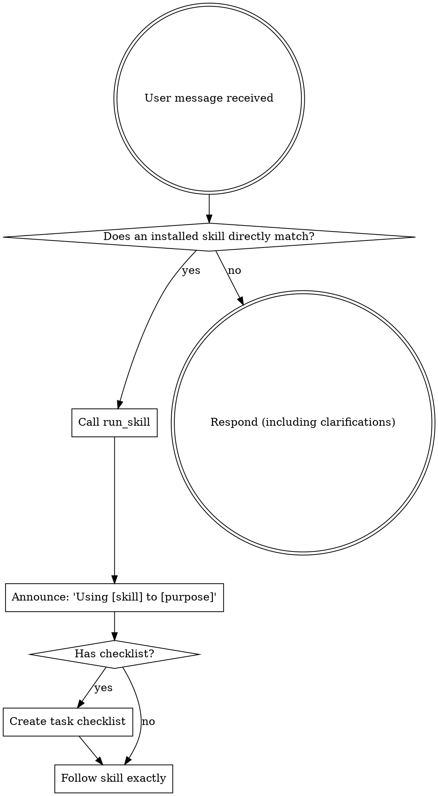

Use a skill when the user explicitly names it or an installed skill directly matches the requested task. Do not load unrelated skills speculatively; each invocation consumes context and may introduce irrelevant workflow constraints.

## How to Access Skills

**In Visionox-Whale:** Call `run_skill` with the skill's bare name and the concrete task in `arguments`. The returned content is the active playbook; follow it directly. Do not bypass `run_skill` by reading deployed skill files directly.

# Using Skills

## The Rule

**Invoke explicitly requested or directly matching skills before taking task actions.** If no installed skill clearly matches, proceed with the normal project workflow.

## Red Flags

Use this checklist when a skill directly matches:

| Thought | Reality |
|---------|---------|
| "This is just a simple question" | A named or directly matching skill still applies. |
| "I need more context first" | Invoke a directly matching skill before task actions. |
| "Let me explore the codebase first" | A matching process skill may define how to explore. |
| "I can check git/files quickly" | First honor any skill explicitly requested by the user. |
| "Let me gather information first" | Use a matching research skill when appropriate. |
| "This doesn't need a formal skill" | Use it when the match is direct, not merely possible. |
| "I remember this skill" | Skills evolve. Read current version. |
| "This doesn't count as a task" | Action = task. Check for skills. |
| "The skill is overkill" | Simple things become complex. Use it. |
| "I'll just do this one thing first" | Check BEFORE doing anything. |
| "This feels productive" | Undisciplined action wastes time. Skills prevent this. |
| "I know what that means" | Knowing the concept ≠ using the skill. Invoke it. |

## Skill Priority

When multiple skills could apply, use this order:

1. **Process skills first** (brainstorming, debugging) - these determine HOW to approach the task
2. **Implementation skills second** (frontend-design, mcp-builder) - these guide execution

"Let's build X" → brainstorming first, then implementation skills.
"Fix this bug" → debugging first, then domain-specific skills.

## Skill Types

**Rigid** (TDD, debugging): Follow exactly. Don't adapt away discipline.

**Flexible** (patterns): Adapt principles to context.

The skill itself tells you which.

## User Instructions

Instructions say WHAT, not HOW. "Add X" or "Fix Y" doesn't mean skip workflows.
